 

  

## `>` whoami

**Ghassen Alimi** - final-year Industrial Engineering student at **ENSIT**, Tunis.

I am interested in industrial simulation, process optimization and data-driven decision-making. I work with FlexSim, SAP, Power BI and Python, and I am currently seeking a PFE internship.

|  |  |
|:--|:--|
| **Availability** | PFE internship |
| **Based in** | Tunis, Tunisia |
| **Focus** | Simulation, process optimization and data analytics |
| **Education** | Industrial Engineering - ENSIT |

## `>` roles I'm targeting

- Industrial Engineering Intern
- Process Improvement Intern
- Production and Operations Intern
- Supply Chain Intern
- Data Analytics Intern

## `>` current focus

| Area | Focus |
|:--|:--|
| **Simulation** | Modelling and analysing industrial systems with FlexSim |
| **Optimization** | Improving processes, flow and operational performance |
| **Data** | Building dashboards and decision-support analyses with Power BI and Python |
| **Enterprise systems** | Developing practical knowledge of SAP and industrial workflows |

## `>` stack

**Industrial Engineering**

**Data and Tools**

## `>` education

**Industrial Engineering Degree**  
ENSIT, Tunis

## `>` contact me about a PFE internship

**I am seeking a PFE internship in industrial engineering, process improvement, production, supply chain or data analytics.**

  

